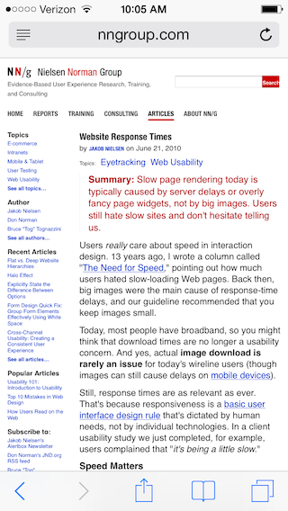
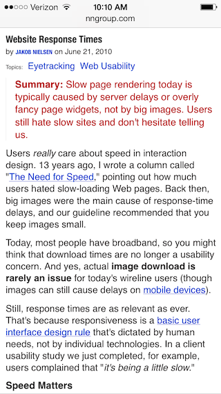

# The 300ms Click Delay - What It Is and What You Can Do About It

Quick feedback is paramount in the implementation of any UI. Studies have shown that [100ms is the maximum delay](http://www.nngroup.com/articles/response-times-3-important-limits/) for an interface to feel instantaneous to the user.

Despite this, the mobile web is plagued by a sweeping feedback problem - a 300ms delay after you touch anything. This delay is one of the most prominent reasons that HTML based web apps are considered "sluggish" by many users.

In this article we'll discuss why the delay exists, what browser vendors are working on to make the problem go away, and what you can do to workaround the issue right now.

### Where Did The 300ms Delay Come From?

Our journey begins in early 2007. Apple was getting ready to release the original iPhone, and they had a problem - the existing web was designed for screens much larger than the one they were developing. To cope with this, they came up with a number of clever conventions for navigating these *"desktop"* sites.

The most well known of these, and the one responsible for the 300ms delay, is known as double tap to zoom.

#### Double Tap To Zoom

Double tap to zoom works exactly as it sounds; when you tap your finger twice on the screen, iOS Safari intelligently zooms the webpage in on the actual content.

For example consider this [article on website response times](http://www.nngroup.com/articles/website-response-times/). When you scan the screen there are a lot controls other than the content of the article to look at - banners, menus, and so forth.

If you happen to navigate to this page, chances are all you want to do is read the article. And if you double tap on the screen, iOS Safari intelligently zooms into the content, as shown below.

From personal experience, and as the example above shows, iOS Safari's implementation of double tap to zoom is *very* good at pinpointing the actual content of web sites and intelligently zooming into it.

So how does the 300ms delay play into all of this?

Let's suppose the user touches a link in iOS Safari. Because the user has the ability to double tap to zoom or scroll, whenever the user touches the screen, the browser does not instantaneously know whether the user meant to click the link or is double tapping. Therefore iOS Safari waits 300ms after the first tap to see if the user taps again.

And thus, the 300ms click delay was born.

#### The 300ms Delay in a Post-iPhone World

The iPhone was obviously successful, therefore subsequent mobile browsers replicated most of its conventions - including double tap to zoom, which is now a feature of every major mobile browser.

Six years ago, this performance penalty wasn't a big deal; we were amazed to simply view the internet on a mobile device. Today however, we're building powerful applications that can compete with native performance, and a 300ms delay on all clicks is a big problem. Plus, with the advent of responsive design, we're building sites that automatically adapt to the device's size, without the need of conventions like double tap to zoom.

Luckily, browsers are aware of this problem and have come up with a number of potential solutions.

*Note: There's one more - lesser known - convention that iOS Safari uses. You can double tap on the bottom and top 1/4 or so of the screen to scroll the content. Have you ever tried to vertically scroll a zoomed in page and been frustrated by the content shifting horizontally? This is the problem double tap to scroll is trying to prevent. While subsequent mobile browsers replicated double tap to zoom, they did **not** implement double tap to scroll. We'll see why this is important later.*

### Browser Solutions

Due to the competition to build a fast mobile browser, avoiding the click delay has been a high priority of all browser vendors (ironically, sans Apple). As such they have come up with a few interesting solutions.

#### Disable Zooming

The first solution to this problem is a common sense approach. Since the double tap to zoom action only makes sense on sites that *can* be zoomed, why not disable the delay on pages that *cannot*? This specifically refers to a site that uses one of the following `<meta>` viewport tags.

	<meta name="viewport" content="user-scalable=no">
	<meta name="viewport" content="initial-scale=1,maximum-scale=1">
	
Chrome for Android [was the first](https://code.google.com/p/chromium/issues/detail?id=169642) to introduce this change, and [Firefox for Android](https://bugzilla.mozilla.org/show_bug.cgi?id=922896) soon followed. No other browser vendors have announced plans to add this optimization.

While this solution is pretty slick, there's one major problem - for it to work, you have to disable zooming, which is a vital usability and accessibility feature for mobile web sites. Have you ever tried to zoom into an image or small text on your phone just to discover you couldn't? Then you've seen this problem in the wild.

While disabling zoom does make sense in certain unique use cases - such as web based games - most sites do not benefit from the optimizations made in Chrome for Android and Firefox for Android.

Fortunately, the Google Chrome team has very recently come up with something better.

#### width=device-width Meta Tag

Like double tap to zoom, another of the iPhone's original conventions for dealing with desktop sites is to [start all sites with an initial viewport of 980 pixels](https://developer.apple.com/library/ios/documentation/AppleApplications/Reference/SafariWebContent/UsingtheViewport/UsingtheViewport.html), rather than the actual width of the device (in the case of the iPhone, 320 pixels).

Consider a simple web page with a 320 pixel widget image of a cat.

	<!doctype html>
	<html>
	    <head><title>Kitty!</title></head>
	    <body>
	        
	    </body>
	</html>
	
Because a 980 pixel viewport is used by default, our kitty is quite small when viewed on an iPhone.

Luckily the same `<meta>` viewport tag we saw earlier can be used to configure this.

	<meta name="viewport" content="width=device-width">
	
This tells the browser to set the viewport of the browser to the same size as device. Therefore including the tag on an iPhone sets the default viewport to 320 pixels rather than 980. After adding the tag to our simple site, our 320 pixel wide kitten image now takes up the full width of the screen.

*Note: The default large viewport is another iPhone convention that was replicated by all subsequent mobile browsers. Therefore this issue is not specific to the iPhone or iOS Safari.*

So how does any of this relate to the 300ms click delay?

The Chrome team [just announced](https://groups.google.com/a/chromium.org/forum/#!topic/chromium-dev/8evES7o-QTY) that as of Chrome 32, they will [disable double tap to zoom on sites that include a width=device-width or narrower viewport](https://codereview.chromium.org/18850005/). And of course, no double tap to zoom means no 300ms click delay.

This change makes a whole lot of sense when you think about it. Double tap to zoom was created to zoom in on desktop sized sites before we even knew what responsive design was. Sites that have included a `width=device-width` `<meta>` viewport tag have declared that they are using a responsive design, therefore it makes sense to eliminate the possibility to double tap to zoom on these pages.

The other key to this technique is that it only removes the ability to double tap to zoom, pinching to zoom is left intact. Therefore the usability and accessibility issues associated with disabling zoom are not present.

In my opinion this is a huge performance win for the mobile web and something to be excited about. Of course, the big caveat to this excitement is the `width=device-width` optimization is only implemented in Chrome 32, which isn't even out yet.

Will other browser vendors implement the optimization as well? Since it results in such a big performance gain I find it hard to imagine that Firefox won't follow suit. Internet Explorer might, unless they believe that pointer events are the only solution to this problem (more on that in a minute). The most interesting case here is iOS.

Recall from earlier that iOS is the only mobile browser that offers double tap to scroll behavior in addition to double tap to zoom. If iOS were to implement this optimization, they would have to remove this feature from the browser. Time will tell whether they go down this route or not.

This wraps our look at `<meta>` viewport based solutions to the 300ms click delay, but there's one other approach to this problem that we need to discuss - pointer events.

#### Pointer Events

Pointer Events are a new series of events for the web proposed by Microsoft that is now a [candidate recommendation W3C specification](https://dvcs.w3.org/hg/pointerevents/raw-file/tip/pointerEvents.html). The pointer events specification is an attempt to unify our handling of all input types - mouse, touch, stylus, etc - using a single event model.

For example instead of explicitly listening for `touchstart` and `mousedown` events on an element, you could just listen for a `pointerdown` event. While a comprehensive look at pointer events is outside the scope of this article, there's one portion of the implementation that is directly relevant to our conversation on click delays, a new CSS property - `touch-action`.

Per [the spec](https://dvcs.w3.org/hg/pointerevents/raw-file/tip/pointerEvents.html#the-touch-action-css-property), the `touch-action` property determines *"whether touch input MAY trigger default behavior supplied by the user agent. This includes, but is not limited to, behaviors such as pinching and zooming."*

From a practical point of view, `touch-action` determines whether you can pinch to zoom or double tap to zoom after touching the targeted element. Therefore this is perfect for solving our 300ms click delay.

The default value of `touch-action` is `auto`, and switching it to `none` removes the 300ms delay on any targeted element. For example the following removes the delay on all links and buttons in IE10 and IE11.

	a[href], button {
	    -ms-touch-action: none; /* IE10 */
	    touch-action: none;     /* IE11 */
	}
	
You can even add `touch-action: none` to the `<body>` to [disable double tap to zoom entirely](http://blogs.msdn.com/b/askie/archive/2013/01/06/how-to-implement-the-ms-touch-action-none-property-to-disable-double-tap-zoom-on-touch-devices.aspx) (Note: This also disables pinch to zoom, so it's subject to the same accessibility and usability issues associated with disabling zoom that we discussed earlier.)

Unfortunately, pointer events are currently only implemented in Internet Explorer, although Chrome has announced that they [plan to support it](https://code.google.com/p/chromium/issues/detail?id=196799) in the future.

The good news is that there are some polyfills that let you use pointer events in your applications today. Let's take a look at those and other solutions to the 300ms delay you can use today next.

### How To Avoid The Delay Today

While browsers have come up with some interesting solutions to the 300ms click delay, there is simply no solution that works everywhere. However, there are plenty of smart people that have thought about this problem and have come up with JavaScript based solutions for all platforms. These solutions can be categorized into two camps - polyfills for the pointer events model and "fast click" solutions.

Let's look at some pointer event polyfills first.

#### Pointer Event Polyfills

There a several polyfills out there for pointer events. Here are the more popular ones.

* [Polymer's](https://github.com/Polymer/PointerEvents) from Google
* [HandJS](http://handjs.codeplex.com/) from Microsoft
* [Points](https://github.com/Rich-Harris/Points) by [@Rich-Harris](https://github.com/Rich-Harris)

For the purpose of avoiding the 300ms click delay, the main thing we care about is how these polyfills tackle replicating the `touch-action` CSS property in non-IE browsers, which is actually a non-trivial challenge. Because browsers disregard CSS properties that they do not support, the only way to determine whether the user actually specified `touch-action: none` is to literally request and parse all stylesheets in JavaScript. HandJS actually does this, but there are obviously some performance and complexity issues with such as approach.

Polymer avoids this problem by using a `touch-action` *attribute* and ignores the CSS rule. For example the following is how you tell Polymer to replicate the CSS `touch-action: none` property on a link.

	<a href="http://google.com" touch-action="none">Google</a>

What does all of this mean for you? If you are interested in digging into pointer events, then these polyfills are an excellent way to use them today. However, if you're just looking for a solution to the 300ms click delay, these solutions are a bit heavy and require either resource intensive or non-standard solutions for replicating the `touch-action` property. Therefore you're better off with the solutions that specifically aim to fix the 300ms delay, which we'll look at next.

*Note: Much of this explanation in this section was based on the [README from the Points polyfill](https://github.com/Rich-Harris/Points/blob/master/README.md). If you found this interesting, it's worth a read.*

#### FastClick

[FastClick](https://github.com/ftlabs/fastclick) is a small library developed by [FT Labs](http://labs.ft.com/) that specifically aims to prevent the 300ms click delay in mobile browsers. At a high level, FastClick works by immediately triggering a synthetic `click` event using [DOM custom events](https://developer.mozilla.org/en-US/docs/Web/API/CustomEvent) for every `touchend` event that occurs. It then suppresses the true `click` event triggered by the browser 300ms later.

The nice thing about FastClick is that it's extremely easy to use, just call `FastClick.attach()` on the `<body>` after the window loads.

	window.addEventListener( "load", function() {
	    FastClick.attach( document.body );
	}, false );

The `attach()` can be called on a more granular level, but invoking it on the `<body>` ensures the solution applies to the entire application. What's also cool is FastClick is smart enough to detect when the `<meta>` tag and `touch-action` based solutions are present, and exit without doing anything. Therefore it makes for an excellent workaround until we have a true solution for all platforms.

As of now FastClick is considered the de facto solution for the 300ms click delay. The only critique of the script is its size (even though it's only 10kb). If you're concerned by that size you might want to look into [Tappy!](https://github.com/filamentgroup/tappy/) by the [Filament Group](http://filamentgroup.com/), or [tap.js](https://github.com/alexgibson/tap.js). Both are very lightweight scripts that let you listen for a `tap` event instead of `click` to avoid the 300ms delay.

#### Kendo UI Mobile

One final thing worth mentioning, if you're a [Kendo UI Mobile](http://www.kendoui.com/mobile.aspx) user, you don't have to worry about any of this; a custom click delay solution is packaged into the library as part of the [Touch widget](http://demos.kendoui.com/mobile/touch/index.html). The touch widget is a cross-platform API for handling user initiated touch events on all platforms, and all of Kendo UI Mobile's widgets know to use it by default.

In fact, we feel that this was one of the main reasons why people couldn't tell whether our custom built app - cuteness - was a web app or a native app in our [HTML5 Mobile Challenge](http://www.kendoui.com/appchallenge.aspx). If you haven't already, load up [cuteness.io](http://cuteness.io) on your mobile device and see just how responsive it is.

### Wrapping Up

While Apple's invention of double tap to zoom was an excellent means of viewing desktop sites on mobile devices, it also left us with a 300ms click delay that is a major contributor to the mobile web feeling sluggish.

Browsers have come up with a number of solutions to deal with this issue. Chrome for Android and Firefox for Android disable double tap to zoom on sites where zoom is disabled, Chrome 32+ disables double tap to zoom on sites with a `width=device-width` `<meta>` tag, and Internet Explorer does not use a delay on elements with its new `touch-action` CSS property set to `none`.

Because these solutions are fragmented, there are a number of JavaScript based solutions out there. This includes several pointer event polyfills, scripts built specifically for this problem such as FastClick, and custom solutions such as the one packaged in Kendo UI Mobile.

While JavaScript solutions provide a decent stopgap to workaround this delay, a natively implemented browser solution such as Chrome's `width=device-width` optimization or Internet Explorer's pointer events is more ideal long term.

Let's cross our fingers.
